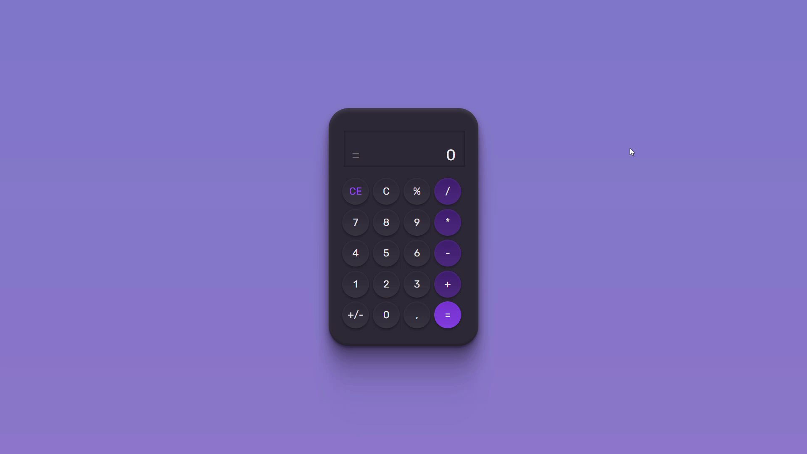

# **Calculator APP** 🖩🖩🖩

## **#boraCodar Desafio #05 (rocketseat)** 🚀

### A proposta do evento #boraCodar (desafio #05) é desevolver uma calculadora do zero.

---

 

### _Result Overview:_

---

 

### _Passo a Passo do Projeto (narrativa):_

O meu primeiro passo foi tirar o projeto do figma e tranforma-lo em código HTML e CSS. Em seguida adicionei as funcionalidades com JavaScript.
Para adicionar as funcionalidades, comecei atribuindo eventListeners ao meu documento ('click', 'keypress'), permitindo assim a interação e entrada de dados por parti do usuário. Então direcionei as possíveis entradas para uma função que determinava qual era o tipo.
Definido o tipo da entrada, é hora de processar os valores e entregar as saídas. Para melhor separar as responsabilidades desta ultima etapa, crie três funcões.

---

 

### _Conhecimento Aplicados:_

- Figma
- HTML
- CSS
- Lógica de Programação
- JS
- DOM

---

 

### _Comentário:_

Para roda no seu navegador basta abrir com a extresão Live Sever do VS Code.

### _Links Importantes:_

- https://boracodar.dev/#
